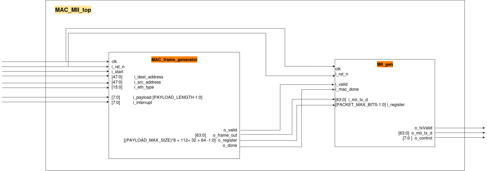
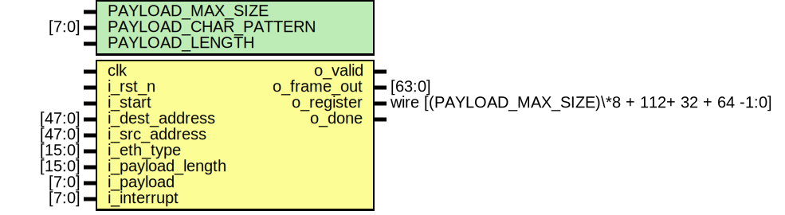

Este proyecto fue realizado como parte de capacitación en un curso de la Fundación Fulgor.

# MAC_MII_GEN

## Descripción General

El módulo `mac_mii_top` conecta los módulos `mac_frame_generator` y `MII_gen` para formar un sistema completo de generación y transmisión de tramas Ethernet a través de la interfaz MII (Media Independent Interface). \
Este módulo actúa como una capa superior que integra la funcionalidad de generación de tramas Ethernet (encabezados, payload, padding, y CRC) con la transmisión en bloques de 64 bits hacia la interfaz MII.

# MAC gen

## Descripción General

El módulo mac_frame_generator implementa la generación de tramas de MAC a nivel de hardware utilizando Verilog. \
Es capaz de construir tramas completas que incluyen preámbulo, dirección de destino, dirección de origen, tipo de EtherType, carga útil (payload), padding, y un cálculo del CRC32 final. \
Está diseñado para ser parametrizable.\
Para información más detallada y particular de los parámetros y señales particulares se recomienda utilizar la extensión ` TerosHDL ` en vs-code. 

### Señales de Control

- `Inicio de Generación:` Cuando i_start se activa, el módulo comienza a generar la trama.
- ` "interrpciones":`     La entrada **_i_interruption_**  es un arreglo de 8 bits que permite realizar algunas acciones específicas en la trasmisión. Por ahora las interrupciones disponibles son:

- `Indicador de Validez:` La señal o_valid indica que los datos en o_frame_out son válidos.
- `Finalización:`         La señal o_done se activa una vez que la generación de la trama ha finalizado.

### Notas Adicionales

- `Preámbulo y SFD:` El preámbulo (7 bytes) y el delimitador de inicio (SFD) se generan automáticamente según la especificación Ethernet.
- `Registro Completo:` La salida o_register contiene toda la trama Ethernet generada, incluyendo preámbulo, encabezado, payload, padding, y CRC32.

# MII_gen

## Descripción General

El módulo `MII_gen` implementa la generación de tramas Ethernet mediante la interfaz MII (Media Independent Interface). Este módulo construye tramas Ethernet con preámbulo, encabezado, carga útil (payload), padding si es necesario, y el código de fin de trama (EOF). \
Está diseñado para ser parametrizable, lo que lo hace adecuado para una amplia variedad de aplicaciones.\
Para información más detallada y particular de los parámetros y señales se recomienda  utilizar la extensión ` TerosHDL ` en vs-code. 

## Estructura de la Trama

El módulo genera tramas Ethernet con la siguiente estructura:
1. **Start of Frame**: 1 byte (`START_CODE`).
2. **Preamble**: 7 bytes.
3. **SFD**: 1 byte.
4. **Destination Address**: 6 bytes.
5. **Source Address**: 6 bytes.
6. **Length/Type**: 2 bytes.
7. **Payload**: 46-1500 bytes.
8. **Frame Check Sequence (CRC)**: 4 bytes.
9. **EOF**: 1 byte (`EOF_CODE`).

---

### Control del Payload y Padding

1. Si el payload tiene menos de 46 bytes (tamaño mínimo según el estándar Ethernet), el módulo agrega padding automáticamente para cumplir con este requisito.
2. Si el payload tiene 46 bytes o más, se transmite directamente, junto con el encabezado y el CRC.

### Gestión de la Transmisión

- El estado `IDLE` genera códigos `IDLE_CODE` mientras espera la habilitación de transmisión (`i_mii_tx_en`).
- El estado `PAYLOAD` transmite la carga útil y el CRC, segmentando la transmisión en bloques de 64 bits para la interfaz MII.
- El estado `DONE` finaliza la transmisión enviando el código `EOF_CODE` seguido de códigos `IDLE`.

## Señales de Control

- Inicio de Transmisión: La señal i_mii_tx_en habilita la transmisión.
- Datos Válidos: La señal o_txValid indica que los datos en o_mii_tx_d son válidos para transmisión.
- Control de Salida: La señal o_control se utiliza para controlar el estado de la interfaz MII durante la transmisión.

## Notas adicionales
1. **Automatización de Padding:** El módulo agrega automáticamente el padding necesario si el payload es menor a 46 bytes.
2. **Tramas Ethernet Completas:** La trama generada incluye encabezado, payload, padding, y CRC, cumpliendo con los estándares de Ethernet.
3. **Interfaz MII:** El módulo está diseñado para funcionar de manera eficiente con la interfaz Media Independent Interface (MII), dividiendo los datos en bloques de 64 bits.
