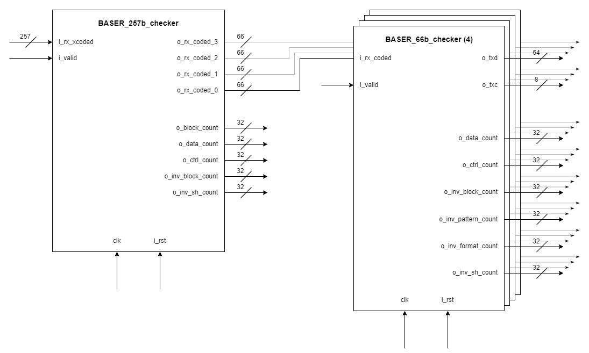

# 1.6TBASE-R signal checker

## Descripción General

Este proyecto consiste en dos agentes de verificación -`BASER_257b_checker` y `BASER_66b_checker`- que analizan las tramas de PCS 256b/257b y 64b/66b respectivamente. Estos poseen contadores que indican la cantidad de tramas inválidas recibidas.

### Contadores

- `o_block_count`: Total de tramas recibidas, de las cuales:
    - `o_data_count`: Tramas con todos los bloques/octetos de dato.
    - `o_ctrl_count`: Tramas con al menos un bloque/octeto de control.
- `o_inv_block_count`: Total de tramas inválidas, de las cuales:
    - `o_inv_pattern_count`: Tramas con un patrón de caracter diferente al especificado en los parámetros.
    - `o_inv_format_count`: Tramas con un formato que no existe en la norma.
    - `o_inv_sh_count`: Tramas con sync header inválido.

### Parámetros configurables
- **Ancho de la interfaz**
    - `DATA_WIDTH`
    - `HDR_WIDTH`
    - `FRAME_WIDTH`
    - `TC_DATA_WIDTH`
    - `TC_HDR_WIDTH`
    - `TC_WIDTH`
- **Patrones de dato fijos**
    - `DATA_CHAR_PATTERN`
- **Patrones de control fijos**
    - `CTRL_CHAR_PATTERN`
    - `OSET_CHAR_PATTERN`

# 1.6TBASE-R 256b/257b checker

## Descripción General

El agente `BASER_257b_checker` recibe tramas de 256b/257b para analizar su validez y, cuando `i_valid` está en 1, las convierte en 4 tramas de 64b/66b.

# 1.6TBASE-R 64b/66b checker

## Descripción General

El agente `BASER_66b_checker` recibe 4 tramas de 64b/66b para analizar su validez y las convierte una por una en señales de 1.6TMII. Cuando termina de convertir, se activa la señal `o_valid`.

